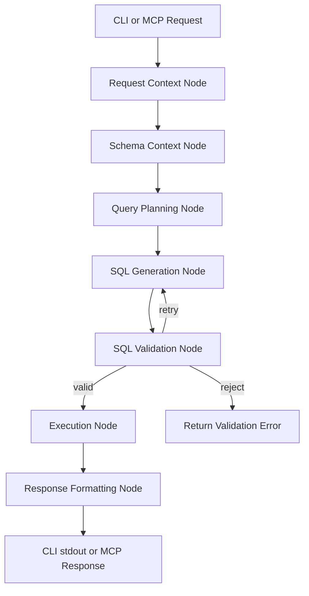

# Design Doc: Read-Only MSSQL Query MCP Server

> Please DON'T remove notes for AI

## Requirements

> Notes for AI: Keep it simple and clear.
> If the requirements are abstract, write concrete user stories

Build a read-only assistant that lets users explore a Microsoft SQL Server database with natural-language questions. The first user interface is a CLI command, but the MVP should also be designed so the same Pocket Flow pipeline can sit behind an MCP-compatible HTTP server.

### MVP goals

- Accept a natural-language question such as "show the 10 most recent orders".
- Use Gemini as the primary LLM backend for NL -> SQL generation.
- Support an OpenAI-compatible fallback backend for local or hosted alternatives.
- Execute only read-only SQL against MSSQL.
- Support both:
  - basic single-table lookups
  - advanced multi-table queries with joins, filters, sorting, and aggregates
- Return readable text output by default, with optional JSON output for structured clients.
- Restrict access to approved tables and columns through configuration.

### User stories

1. **Business analyst**: As an analyst, I can ask for recent records or summary counts in plain English and receive a readable answer without writing SQL by hand.
2. **Developer**: As a developer, I can run the same query flow from a CLI command during local development and later expose it through an MCP server without rewriting the core logic.
3. **Data steward**: As a data owner, I can define which tables and columns are allowed so the assistant only queries approved schema areas.
4. **Platform operator**: As an operator, I can choose Gemini first and still have an OpenAI-compatible fallback if the primary provider is unavailable or unsuitable.

### Non-goals for Phase 1

- INSERT, UPDATE, DELETE, MERGE, DDL, or any schema mutation
- automatic schema changes or data writes
- rich web UI or desktop UI
- charts, visual rendering agents, or multi-agent orchestration
- full multi-user authorization and key-based policy management beyond simple configured allowlists

## Flow Design

> Notes for AI:
> 1. Consider the design patterns of agent, map-reduce, rag, and workflow. Apply them if they fit.
> 2. Present a concise, high-level description of the workflow.

### Applicable Design Pattern:

1. **Workflow**
   - The MVP is primarily a deterministic workflow: accept request, gather schema context, generate SQL, validate it, execute it, and format the response.
2. **Structured Output**
   - LLM nodes should return structured planning data such as target tables, filters, and SQL candidates in YAML or JSON so validation is predictable.
3. **Guarded retry loop**
   - If validation fails, the flow should loop back to SQL generation with validator feedback until a valid read-only query is produced or retries are exhausted.
4. **Light agentic routing**
   - *Context*: user question plus allowed schema summary
   - *Action*: choose likely tables and joins before SQL generation

### Flow high-level Design:

1. **Request Context Node**: Normalizes the incoming CLI or MCP request, output format, and target database profile into the shared store.
2. **Schema Context Node**: Loads the approved schema metadata and builds a compact prompt context for the LLM.
3. **Query Planning Node**: Interprets the question, selects likely tables, and identifies filters, joins, and aggregation intent.
4. **SQL Generation Node**: Produces a candidate SELECT query using the plan and schema context.
5. **SQL Validation Node**: Confirms the query is read-only, single-statement, and limited to approved tables and columns.
6. **Execution Node**: Runs the validated query against MSSQL and captures rows, columns, and execution metadata.
7. **Response Formatting Node**: Converts raw results into human-readable text or JSON for the caller.



### Architecture summary

The system should have two thin entry points that share one Pocket Flow pipeline:

- **CLI entry point** in `main.py` for local development and scripted usage
- **FastAPI MCP server** in `server.py` for HTTP-based tool access

Both entry points should populate the same shared store contract and call the same query flow. This keeps the business logic inside Pocket Flow nodes and prevents the transport layer from owning query generation logic.

## Utility Functions

> Notes for AI:
> 1. Understand the utility function definition thoroughly by reviewing the doc.
> 2. Include only the necessary utility functions, based on nodes in the flow.

1. **LLM Router** (`utils/call_llm.py`)
   - *Input*: prompt payload, provider preference, fallback settings
   - *Output*: model response text
   - Routes requests to Gemini first and falls back to an OpenAI-compatible backend when configured

2. **Runtime Config Loader** (`utils/load_config.py`)
   - *Input*: config path or environment variables
   - *Output*: normalized app config including database profiles, LLM provider settings, output defaults, and query policy
   - Keeps environment and policy handling outside the nodes

3. **Schema Loader** (`utils/schema_loader.py`)
   - *Input*: database connection settings and allowlist config
   - *Output*: approved table and column metadata plus a compact schema summary for prompting
   - Ensures the flow only sees approved schema information

4. **SQL Validator** (`utils/sql_validator.py`)
   - *Input*: candidate SQL and allowlist policy
   - *Output*: validation result with `is_valid`, errors, referenced tables, referenced columns, and normalized SQL
   - Enforces SELECT-only access and blocks disallowed schema usage before execution

5. **Database Executor** (`utils/db_executor.py`)
   - *Input*: validated SQL and MSSQL connection profile
   - *Output*: rows, columns, row count, and execution metadata
   - Encapsulates `pyodbc` or equivalent MSSQL access in a single utility layer

6. **Result Formatter** (`utils/format_results.py`)
   - *Input*: execution results and requested response format
   - *Output*: plain text table, markdown-style text, or JSON-ready structure
   - Keeps presentation rules separate from execution and planning

## Node Design

### Shared Store

> Notes for AI: Try to minimize data redundancy

The shared store should keep request state, approved schema context, query artifacts, and final output in one place:

```python
shared = {
    "request": {
        "question": "show the top 10 products by sales",
        "source": "cli",  # or "mcp"
        "db_profile": "dev",
        "response_format": "text",
    },
    "config": {
        "llm": {
            "primary_provider": "gemini",
            "fallback_provider": "openai_compatible",
        },
        "policy": {
            "allowed_tables": ["Products", "Orders", "OrderLines"],
            "allowed_columns": {
                "Products": ["ProductID", "Name"],
                "Orders": ["OrderID", "OrderDate"],
                "OrderLines": ["OrderID", "ProductID", "LineTotal"],
            },
            "max_rows": 100,
        },
    },
    "schema": {
        "tables": {},
        "prompt_context": "",
    },
    "plan": {
        "intent": "",
        "target_tables": [],
        "joins": [],
        "filters": [],
        "aggregations": [],
    },
    "query": {
        "sql": "",
        "attempt": 0,
        "validation_errors": [],
    },
    "execution": {
        "columns": [],
        "rows": [],
        "row_count": 0,
    },
    "response": {
        "text": None,
        "json": None,
        "metadata": {},
    },
}
```

### Node Steps

> Notes for AI: Carefully decide whether to use Batch/Async Node/Flow.

1. Request Context Node
  - *Purpose*: Normalize input from CLI or MCP and load the requested database profile and output mode
  - *Type*: Regular
  - *Steps*:
    - *prep*: Read raw user request and startup configuration
    - *exec*: Normalize the request payload into a standard internal structure
    - *post*: Write `request` and initial `config` fields to the shared store

2. Schema Context Node
  - *Purpose*: Load approved schema metadata for prompting and validation
  - *Type*: Regular
  - *Steps*:
    - *prep*: Read the target DB profile and access policy from the shared store
    - *exec*: Call the schema loader utility and build a compact schema summary
    - *post*: Write `schema.tables` and `schema.prompt_context`

3. Query Planning Node
  - *Purpose*: Convert the natural-language request into a structured plan before generating SQL
  - *Type*: Regular
  - *Steps*:
    - *prep*: Read `request.question` and `schema.prompt_context`
    - *exec*: Call the LLM router for structured planning output
    - *post*: Write `plan.intent`, `plan.target_tables`, `plan.filters`, `plan.joins`, and `plan.aggregations`

4. SQL Generation Node
  - *Purpose*: Produce a candidate SELECT query from the plan
  - *Type*: Regular
  - *Steps*:
    - *prep*: Read `request`, `schema.prompt_context`, `plan`, and any previous validator feedback
    - *exec*: Call the LLM router to generate a single SQL statement
    - *post*: Write `query.sql`, increment `query.attempt`, and return the next action

5. SQL Validation Node
  - *Purpose*: Enforce safety before anything reaches the database
  - *Type*: Regular
  - *Steps*:
    - *prep*: Read `query.sql` and `config.policy`
    - *exec*: Call the SQL validator utility
    - *post*: Write validation errors and return:
      - `valid` when the query is safe
      - `retry` when the query can be regenerated safely
      - `reject` when the request should fail fast

6. Execution Node
  - *Purpose*: Run the validated query against MSSQL
  - *Type*: Regular
  - *Steps*:
    - *prep*: Read normalized SQL and DB profile
    - *exec*: Call the database executor utility
    - *post*: Write columns, rows, row count, and execution metadata

7. Response Formatting Node
  - *Purpose*: Return the result in a caller-friendly format
  - *Type*: Regular
  - *Steps*:
    - *prep*: Read execution results and `request.response_format`
    - *exec*: Call the result formatter utility
    - *post*: Write `response.text` or `response.json`

## Implementation Layout

The current repository is still the Pocket Flow starter example, so the MVP should evolve it toward the following structure:

```text
llmapp101/
├── main.py
├── server.py
├── flow.py
├── nodes.py
├── utils/
│   ├── __init__.py
│   ├── call_llm.py
│   ├── load_config.py
│   ├── schema_loader.py
│   ├── sql_validator.py
│   ├── db_executor.py
│   └── format_results.py
├── config/
│   ├── app.example.yaml
│   └── access_policy.example.yaml
├── docs/
│   ├── draft.md
│   └── design.md
└── tests/
    ├── test_sql_validator.py
    └── test_format_results.py
```

### Key files to create or modify

- `main.py`: replace the demo QA entry point with a CLI query interface
- `server.py`: add the FastAPI MCP-compatible transport layer
- `flow.py`: define the read-only query workflow and validator retry loop
- `nodes.py`: replace demo nodes with request, schema, planning, generation, validation, execution, and formatting nodes
- `utils/call_llm.py`: evolve from direct OpenAI usage into a provider router with Gemini-first behavior
- `utils/schema_loader.py`: load approved MSSQL schema metadata
- `utils/sql_validator.py`: centralize SELECT-only and allowlist enforcement
- `utils/db_executor.py`: execute validated MSSQL queries
- `requirements.txt`: add dependencies only when the new utilities are implemented, such as FastAPI, PyYAML, a Gemini SDK, and an MSSQL driver
- `config/*.yaml`: keep provider, database, and allowlist settings outside code

## Config and Security Considerations

- Only allow a single read-only statement. Reject multi-statement SQL, comments that hide extra statements, and any DML or DDL keywords.
- Validate both table access and column access against the configured allowlist before execution.
- Apply a maximum row limit and execution timeout to protect the database and keep responses readable.
- Do not expose the entire schema to the LLM if only a subset is allowed.
- Keep secrets in environment variables or local config files outside source control.
- Log enough metadata for debugging, but avoid logging secrets or unnecessarily dumping entire result sets.
- Fail closed: if config, schema loading, validation, or provider routing is ambiguous, return an explicit error rather than guessing.
- Keep the MCP server and CLI as thin adapters so the same safety checks always run regardless of entry point.

## Delivery Notes

- The current codebase is still a Pocket Flow starter template; `docs/design.md` describes the intended MVP architecture for the future implementation, not the current runtime behavior.
- `docs/design.md` should describe the intended MVP architecture, not imply that the MCP server or MSSQL query engine already exists in the current codebase.
- `requirements.txt` should be expanded incrementally alongside implementation so new utilities bring in the right packages at the moment they are introduced.
- The MVP should stay modular so future work can add multi-agent behavior, richer rendering, and stronger access control without rewriting the core flow.
